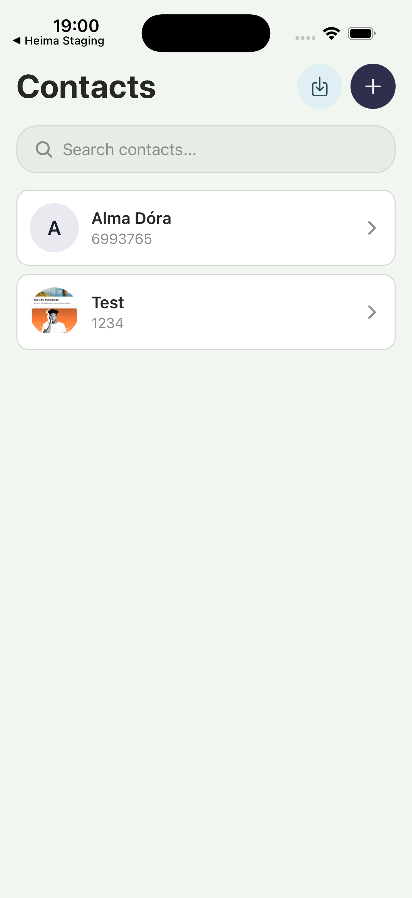
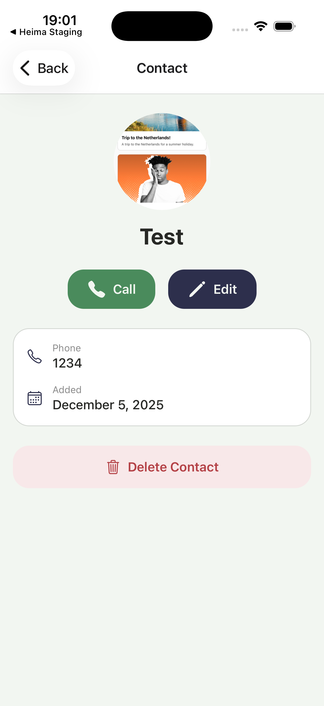
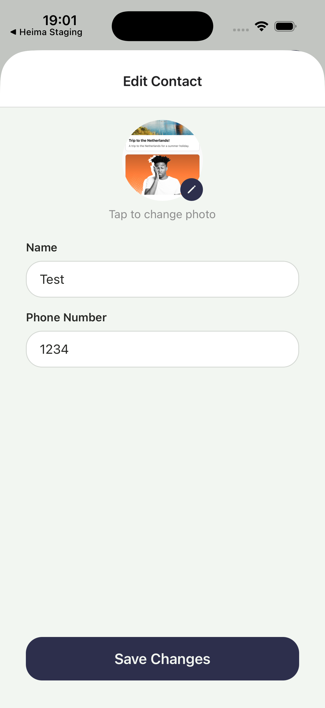
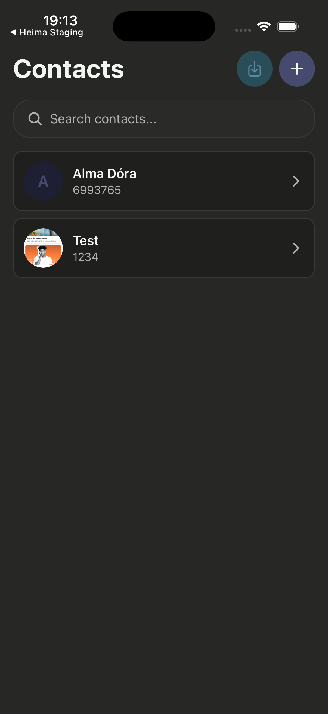
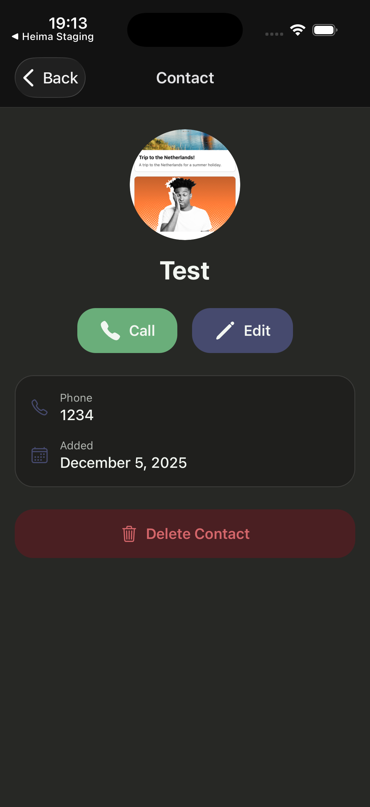
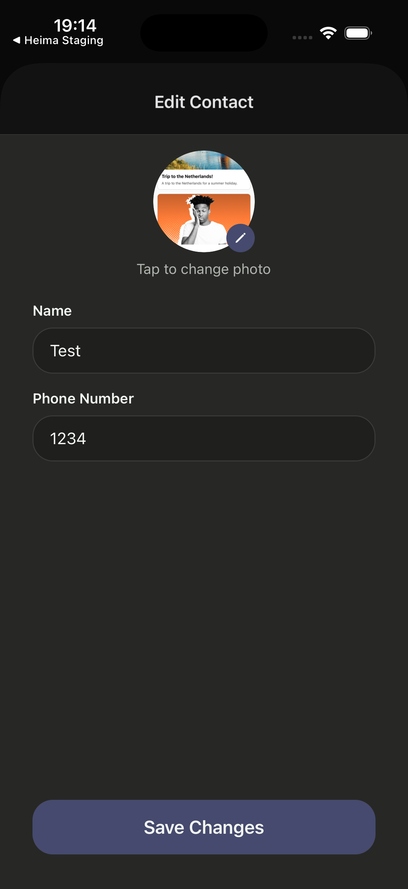

# The Contactor

## Table of Contents

- [Description](#description)
- [Setup Instructions](#setup-instructions)
- [Running the App](#running-the-app)
- [Features](#features)
- [Technologies Used](#technologies-used)
- [Platform Support](#platform-support)
- [Project Structure](#project-structure)
- [Data Storage](#data-storage)
- [Future Improvements](#future-improvements)
- [Authors](#authors)

## Description

The Contactor is a mobile contacts management application built with React Native and Expo. This application enables users to manage their personal contacts with full CRUD operations, including creating, viewing, editing, and deleting contacts. Contacts are stored persistently using Expo FileSystem with Zustand state management, ensuring data remains available across app sessions.

The application features a clean, intuitive interface with contact list viewing (alphabetically sorted), real-time search functionality, detailed contact views, and form-based contact management. Built with modern mobile development practices using Expo Router for file-based navigation, Zustand for state management, and TypeScript for type safety.

## Screenshots

| **Dashboard**                                | **Single Contact**                              | **Edit Contact**                                   |
| -------------------------------------------- | ----------------------------------------------- | -------------------------------------------------- |
|       |       |       |
|  |  |  |

## Setup Instructions

### Prerequisites

- Node.js (v14 or higher, v18+ recommended)
- npm or yarn
- Expo CLI (optional but recommended): `npm install -g expo-cli`
- Xcode (for iOS development, macOS only)
- Android Studio (for Android development)

### Environment Setup

1. Install React Native dependencies
    - Ensure Node.js and npm are installed: `node --version` and `npm --version`
    - Install Expo CLI globally (optional): `npm install -g expo-cli`

2. Configure development environment

    **For iOS (macOS only):**
    - Install Xcode from Mac App Store
    - Install Command Line Tools: `xcode-select --install`
    - Accept Xcode license: `sudo xcodebuild -license accept`

    **For Android:**
    - Install Android Studio from [developer.android.com](https://developer.android.com/studio)
    - Open Android Studio and install Android SDK (API 33 or higher recommended)
    - Configure ANDROID_HOME environment variable

3. Set up emulators/simulators

    **iOS Simulator (macOS):**
    - Open Xcode > Preferences > Components
    - Download desired iOS simulator versions

    **Android Emulator:**
    - Open Android Studio > AVD Manager
    - Create a new virtual device (Pixel 5 recommended)
    - Select a system image (API 33 or higher)
    - Launch the emulator

4. Clone/download the project and install dependencies

    ```bash
    cd T-488-MAPP-A2
    npm install
    ```

5. Start the development server
    ```bash
    npm start
    ```

**Additional useful commands:**

- `npm run test` - Run linting, format checking, and type checking (combined validation)
- `npm run lint` - Run ESLint to check code quality
- `npm run lint:fix` - Automatically fix ESLint issues
- `npm run format` - Format code with Prettier
- `npm run format:check` - Check code formatting

## Running the App

### Navigate to project directory

`cd T-488-MAPP-A2`

### Install dependencies

`npm install`

### Running the App

`npm start`

This will start the Expo development server. You can then:

- Press `i` to run on iOS simulator
- Press `a` to run on Android emulator
- Scan the QR code with Expo Go app on your physical device

**Additional platform-specific commands:**

`npm run ios` - Run directly on iOS simulator

`npm run android` - Run directly on Android emulator

## Features

The application implements features based on Assignment II requirements:

### Core Features

#### 1. Contact List View (1.5 points)

- View a list of all saved contacts
- Alphabetically ordered in ascending order
- Displaying contact name
- Displaying contact thumbnail image

#### 2. Search Functionality (1.5 points)

- Contact list filters dynamically based on search input
- Case-insensitive substring search
- Real-time filtering as you type

#### 3. Add Contact (2 points)

- Form-based interface to add new contacts
- Input fields for name, phone number, and image
- Contacts stored persistently using Expo FileSystem
- Data persisted in JSON format with all required properties

#### 4. Contact Details View (1 point)

- Detailed information display for selected contacts
- Shows contact name, image, and phone number
- Clean, organized layout

#### 5. Edit Contact (2 points)

- All contact properties are editable (name, phone number, image)
- Form pre-populated with existing contact data
- Updates persisted to storage in JSON format

### Extra Features (3 points)

#### Import Contacts from OS (1 point)

- Users can import contacts from their device's native contact list
- Seamless integration with device contacts
- Duplicate detection to prevent importing existing contacts

#### Camera & Photo Import (1 point)

- Add contact images using device camera
- Import images from device photo gallery
- Image picker with both options available

#### Make Phone Calls (1 point)

- Initiate phone calls directly from the app
- Call button on contact detail view
- Deep linking to native phone application

### Additional Polish

- **Swipe Gestures**: Swipe left to edit, swipe right to delete contacts
- **Haptic Feedback**: Tactile feedback for all user interactions
- **Dark/Light Mode**: Automatic theme switching based on system preference
- **Form Validation**: Required field validation with error messages
- **Empty States**: User-friendly messaging when no contacts exist

## Technologies Used

- React Native (v0.81.5)
- Expo (~54.0.25)
- Expo Router (~6.0.15) - File-based routing and navigation
- React Navigation (v7.1.8)
- TypeScript (~5.9.2)
- Zustand (v5.0.8) - Lightweight state management
- Expo FileSystem - Persistent JSON file storage for contacts
- Expo Contacts - Import contacts from device
- Expo Image Picker - Camera and photo gallery access
- Expo Linking - Deep linking for phone calls
- Expo Haptics - Tactile feedback for user interactions
- Expo Crypto - UUID generation for contact IDs
- Expo Vector Icons (v15.0.3)
- React (v19.1.0)
- ESLint (v9.39.1) - Code quality and linting
- Prettier (v3.6.2) - Code formatting
- React Native Reanimated (v4.1.1) - Animations
- React Native Gesture Handler - Touch gesture support
- React Native Safe Area Context (v5.6.0) - Safe area handling

## Platform Support

### Primary Development Platform

- Primary Platform: iOS
- Test Device: iOS Simulator
- OS Version: Latest iOS version supported by Expo SDK 54

### Secondary Platform Testing

- Secondary Platform: Android
- Test Device: Android Emulator
- OS Version: Latest Android version supported by Expo SDK 54
- Testing Status: Both platforms under active development
- Known Platform-Specific Issues: None at this time

#### As one great man once said:

> Cross-platform is just a way of saying 'let's launch iOS and fix Android later.' [@adnansahinovich](https://x.com/adnansahinovich/status/1964569598898192440)

### Platform-Specific Features

No platform-specific features at this time. The application uses React Native's cross-platform capabilities to provide a consistent experience across both iOS and Android.

## Project Structure

```
T-488-MAPP-A2/
├── app/                              # Expo Router navigation
│   ├── (app)/                        # Main app group
│   │   ├── _layout.tsx               # App stack layout
│   │   ├── index.tsx                 # Contacts list screen
│   │   └── contacts/
│   │       └── [id].tsx              # Contact detail screen
│   ├── modals/                       # Modal screens
│   │   ├── _layout.tsx               # Modal stack layout
│   │   ├── add-contact.tsx           # Add contact modal
│   │   └── edit-contact/
│   │       └── [id].tsx              # Edit contact modal
│   ├── _layout.tsx                   # Root layout (providers, store hydration)
│   └── +not-found.tsx                # 404 error screen
├── assets/                           # Static assets
│   ├── fonts/
│   │   └── SpaceMono-Regular.ttf
│   └── images/
│       ├── adaptive-icon.png
│       ├── favicon.png
│       ├── icon.png
│       └── splash-icon.png
├── src/                              # Source code
│   ├── components/                   # Reusable React components
│   │   ├── contacts/                 # Contact-specific components
│   │   │   ├── ContactItem.tsx       # Contact list item
│   │   │   └── index.ts
│   │   ├── layout/                   # Layout components
│   │   │   ├── SafeAreaScreen.tsx
│   │   │   └── index.ts
│   │   ├── ui/                       # UI primitives
│   │   │   ├── Button/
│   │   │   ├── SwipeableRow/         # Swipeable list item with actions
│   │   │   ├── TextInput/
│   │   │   ├── Themed.tsx
│   │   │   └── index.ts
│   │   └── index.ts
│   ├── constants/
│   │   ├── Colors.ts                 # Color definitions
│   │   └── DesignTokens.ts           # Spacing, border radius
│   ├── hooks/
│   │   ├── useColorScheme.ts
│   │   ├── useContactForm.ts         # Shared form logic for add/edit
│   │   ├── useImagePicker.ts         # Camera and gallery image picker
│   │   ├── useImportContacts.ts      # Import contacts from device
│   │   └── useTheme.ts
│   ├── screens/                      # Screen components
│   │   ├── common/
│   │   │   ├── NotFoundScreen.tsx
│   │   │   └── index.ts
│   │   ├── contacts/
│   │   │   ├── AddContactScreen.tsx
│   │   │   ├── ContactDetailScreen.tsx
│   │   │   ├── ContactsListScreen.tsx
│   │   │   ├── EditContactScreen.tsx
│   │   │   └── index.ts
│   │   └── index.ts
│   ├── store/
│   │   ├── fileSystemStorage.ts      # Expo FileSystem storage adapter
│   │   └── useStore.ts               # Zustand store with FileSystem persistence
│   ├── types/                        # TypeScript interfaces
│   │   ├── contact.ts                # Contact type definitions
│   │   └── index.ts
│   └── utils/                        # Utility functions
├── eslint.config.js                  # ESLint configuration (flat config)
├── .prettierrc.js                    # Prettier configuration
├── app.json                          # Expo configuration
├── package.json                      # Dependencies and scripts
└── tsconfig.json                     # TypeScript configuration
```

**Key Directory Explanations:**

- `/app` - Expo Router file-based routing with modal presentation
- `/app/(app)` - Main app screens (contacts list, contact detail)
- `/app/modals` - Modal screens for add/edit contact forms
- `/src/components` - Reusable UI components organized by category
- `/src/screens/contacts` - Contact-related screen components
- `/src/hooks` - Custom React hooks (theme, forms, image picker, import contacts)
- `/src/store` - Zustand store with FileSystem persistence
- `/src/constants` - Design tokens and color definitions
- `/src/types` - TypeScript interfaces for type safety

## Data Storage

### FileSystem Persistence

The Contactor uses Expo FileSystem with Zustand persist middleware to store contact data:

- **Storage Method**: Expo FileSystem (JSON file storage in document directory)
- **File Location**: `contacts.json` in the app's document directory
- **Persistence**: Zustand persist middleware automatically syncs state to the file system
- **Data Format**: JSON format with the following structure:

```json
{
    "id": "uuid-generated-identifier",
    "name": "Contact Name",
    "phoneNumber": "+1234567890",
    "image": "file://path/to/image.jpg",
    "createdAt": "2024-01-01T00:00:00.000Z",
    "updatedAt": "2024-01-01T00:00:00.000Z"
}
```

- **Persistence**: All data persists across app sessions automatically
- **Operations**: Full CRUD (Create, Read, Update, Delete) operations supported

### State Management

The application uses Zustand for lightweight state management with FileSystem persistence:

- **Store State**: Contains contacts array and hydration state
- **CRUD Actions**: addContact, updateContact, deleteContact, getContactById, importContacts
- **Automatic Persistence**: All state changes are automatically synced to the file system

**Usage Example:**

```typescript
import { useStore } from '@/src/store/useStore';

// Access state
const contacts = useStore(state => state.contacts);

// Add a contact
const addContact = useStore(state => state.addContact);
addContact({ name: 'John Doe', phoneNumber: '+1234567890', image: null });

// Get contact by ID
const getContactById = useStore(state => state.getContactById);
const contact = getContactById('contact-id');

// Import contacts from device
const importContacts = useStore(state => state.importContacts);
```

## Future Improvements

### User Experience Enhancements

- Add contact grouping by first letter
- Add contact favorites/starred feature
- Add animations and smooth transitions between screens
- Add contact sorting options (by name, date added, favorites)
- Add bulk operations (delete multiple contacts)

### Additional Features

- Email addresses for contacts
- Multiple phone numbers per contact
- Contact notes and custom fields
- Contact backup and restore
- Contact sharing via QR code
- Integration with messaging apps
- Contact history and activity log
- Cloud synchronization across devices

---

## Authors

- Milos Petrovic
- Nikulás Anthony Swain
- Sunna Einarsdóttir

---

**Project Assignment:** This project is developed as part of Assignment II - The Contactor for T-488-MAPP Mobile Application Development course.
